First Time StartUp
==================

.. contents:: Table of Contents
    :depth: 2
    :local:

Introduction
------------
The video version of this guide can be found on our `YouTube page <https://www.youtube.com/watch?v=cLuNKUZSZRY>`__.

This guide will walk you through the first-time starting up OpenExo. We'll be using 
the bilateral hip configuration of OpenExo, which is the baseline configuration for the system. 
If you're using a different configuration (but still using the Cubemars AK-motors),
you'll follow the same steps apart from setting a different configuration in the SD card. 

We'll start by downloading: 
- VSCode
- Git
- Python
- Arduino IDE & Libraries
- Teensyduino
- OpenExo Firmware

Once we've done that, we'll orient ourselves to relevant portions of the firmware. 

Then we'll upload the ExoCode to the exoskeleton and conduct our first 
trial using the step controller, which applies torque in a simple on-off pattern, to ensure that everything works properly.

It's assumed that you have the OpenExo hardware already built. 
**The build guide is located** on our `hardware wiki <https://youneedawiki.com/app/page/12IDTJPYXY6L5_p-KUMQvKGewktoxTsTX?p=14AIGjap02Wv8jPJxyezvfYJYFVIJIoO1>`_.

Before beginning, you'll also want to make sure that you have a micro SD card available. The storage size doesn't really matter as we aren't putting much data onto it.

Walkthrough of Components
-------------------------
**Teensy**

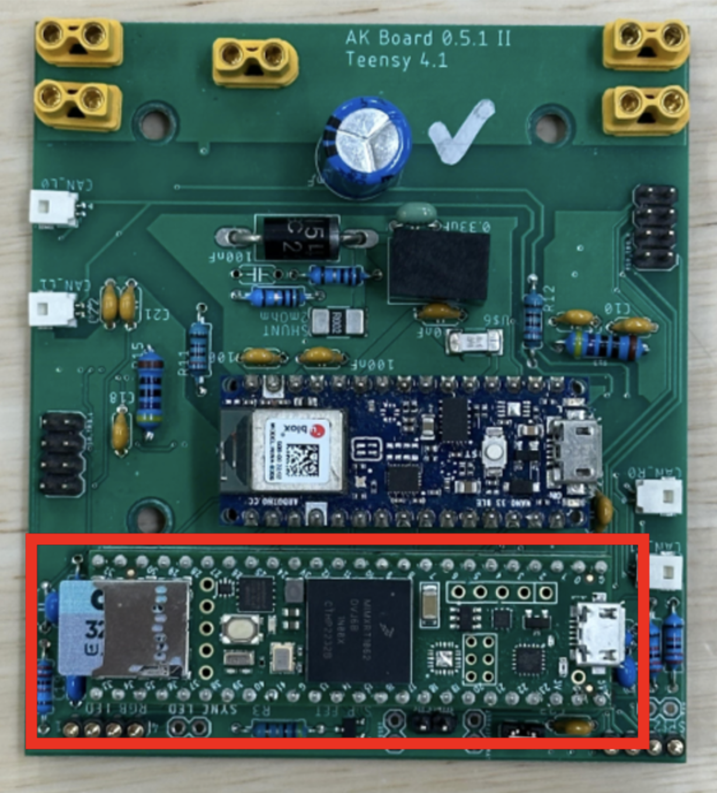

The Teensy 4.1 is where most of the computation/running of commands is done. It 
is a development board that can run Arduino code (with the help of the 
Teensyduino board manager). The Teensy 4.1 has a port for an SD card which you can 
use to store parameters and other data. For our purpose, we'll be using the SD 
card to store parameters for controllers and to specify which controller and
exoskeleton configuration we're using.

**Nano**

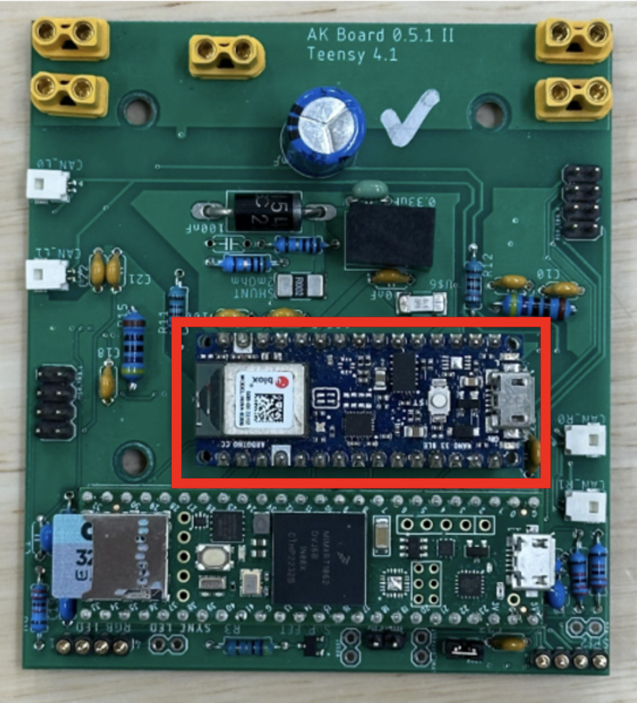

The Arduino Nano is used for Bluetooth communcication with the graphical 
user interface (GUI). It's connected to the Teensy via the PCB and takes 
relevant information from the Teensy and sends it to the GUI so that you can
monitor, visualize, and store data in real-time

Any time you want to change the exoskeleton's code (e.g., to add a new controller, 
change what gets plotted), you'll be uploading that code to **both the 
Teensy and the Nano**.

**PCB**

.. image:: photos/StartupGUide/PCB.png
    :align: center

The PCB, among other things, allows the Teensy and Nano to communicate with each other. Again, the 
Teensy handles most of the computation while the Nano transmits/recieves data to/from the 
GUI.

The PCB also has a number of ports for sensor communication and power, as shown
below:

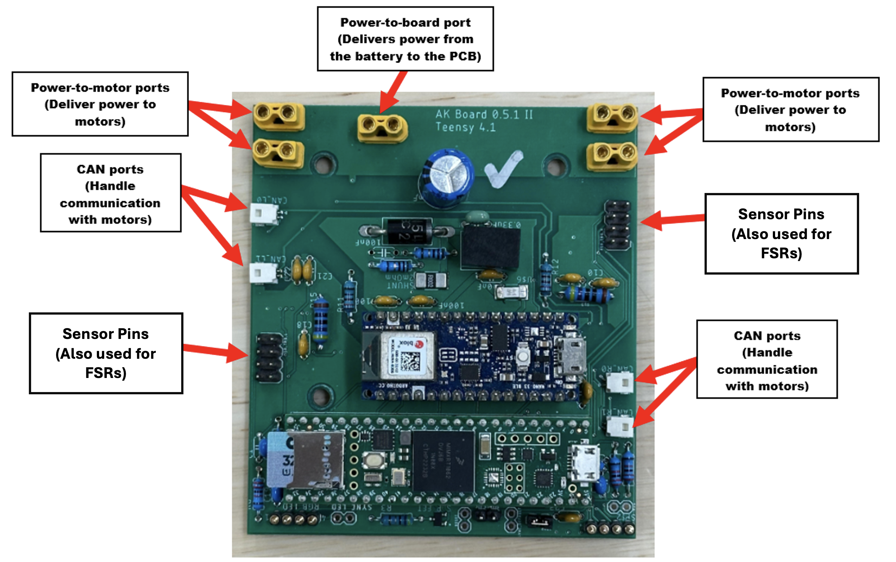

**Motors**

You are able to use a variety of motors with the OpenExo platform. This guide
will focus on the CubeMars AK-series motors but note that it also has support for Maxon 
motors. Currently supported CubeMars motors include the AK60, AK60v1.1,
AK70, and AK80. Work is underway to integrate the v3 versions of these motors (e.g., AK60v3).

It's also assumed that you have already configured the motors according to the 
steps in the `OpenExo Build Guide 
<https://youneedawiki.com/app/page/1w9vU0D8s4FzuBDPr1S0EoYw0GNY82Ze1_4S_gxbFk8Q?p=14AIGjap02Wv8jPJxyezvfYJYFVIJIoO1>`_.

*Troubleshooting Motor Issues*

A brief, helpful, tip for the AK-series motors (excluding the AK60v3s, which
have a different enabling protocol) is that they have a green LED near the ports 
which illuminates when the motors are powered on **and enabled**. If you run into 
issues with the motors not providing torque, the first thing you should do is check to see whether the green LED is on.
If it isn't (but the red one is), then the motors are powering but not enabeling. We first recommend checking the CAN wire, as we have had issues with these in the past. 
If the green LED is on, check the SD card to ensure the proper configuration details (joints, motors, controllers) are set.
If all else fails the issue likely lies within the code and you will need to do a carefult review.
During this stage, be sure to leverage Serial.print("TEXT" or VARIABLE) with the Teensy connected to the computer via the USB cable. 
This will enable you to startigically print text/variables to the serial monitor in the Arduino IDE which can help you identify where issues may be arising.

Downloading the Necessary Software 
----------------------------------

.. raw:: html

    

     === VSCODE ===
   

VSCode is the editor we use to write and edit the exoskeleton's code. In this walkthrough, we'll be 
using VSCode to view the code that defines the parameters that we plot in the 
GUI and to edit the configuration info in the SD card.

VSCode is free to `download <https://code.visualstudio.com/>`_.
For a guide on getting VSCode set up, refer to `Microsoft's own documentation <https://code.visualstudio.com/docs>`_. 
If you get prompted to install any extensions as you're working with the OpenExo code, it's good to go ahead and install them.

It's important to note that while we use VSCode to make edits to the 
exoskeleton's code, the Arduino IDE is what we use to actually upload that code
to the exoskeleton. We'll cover this in more detail later.

.. raw:: html

    

     === GIT ===
   

Git is the version control software we use to manage and track changes to the 
exoskeleton's codebase. It allows multiple developers to collaborate seamlessly,
keep track of revisions, and revert to previous states if necessary. 

Git is free and can be downloaded from the `official site <https://git-scm.com/downloads>`_.

Follow the installation instructions specific to your operating system. Once 
installed, it's recomended to verify that the Git installation was successful
by opening a terminal or command prompt and typing:

.. code-block:: bash

    git --version

If installed correctly, this will display the version of Git installed on your 
computer.

While we use this process, you are more than welcome to download the code directly onto your computer as a folder and operate in there.
The major limitation of this approach is that it will not provide version control and thus any changes you make can not be reverted to a prior version if needed. 
Given this, we highly recommend some internal form (Git or a comprable software) to manage and track changes to the code as you modify it to suit your needs. 

.. raw:: html

    

     === PYTHON ===
    

To run the GUI (which allows the exoskeleton to operate) you'll need Python 
installed on your computer. To install it go to the `Python homepage 
<https://www.python.org/>`_ and click the link under "Download."

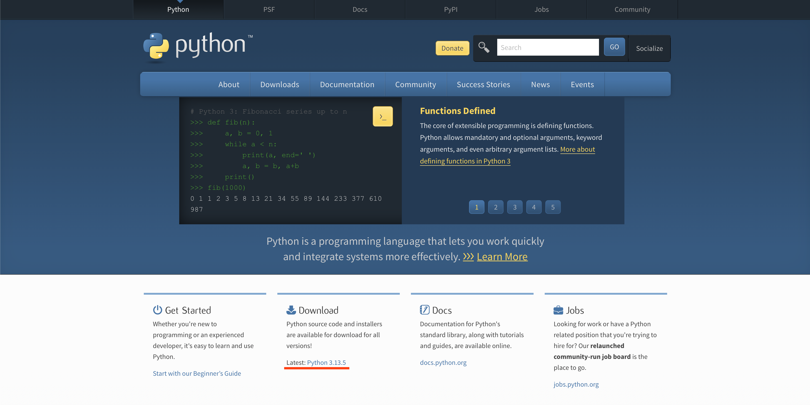

Scroll down to the "Files" section and downlaod the installer corresponding to 
your operating system (likely macOS or Windows 64 bit, but if you're on Windows,
go to Settings > System > About to verify what your operating systems is).

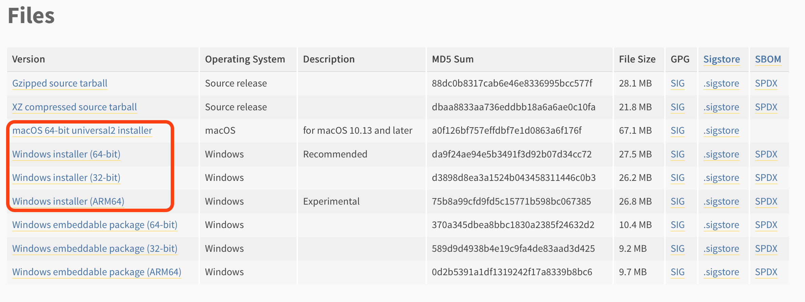

Open the file and follow the installation instructions. Verify that the 
installation was successful by opening the terminal and typing:

.. code-block:: bash

    python3 --version

If the installation was successful, you'll see the version of Python you
installed. 

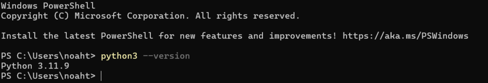

.. raw:: html

    

     === ARDUINO IDE ===
   

The Arduino IDE is what we'll use to flash our code to the Teensy and Nano. To 
install the Arduino IDE, go to `this page 
<https://www.arduino.cc/en/software/?_gl=1*3xagbh*_up*MQ..*_ga*MzM5NTYzNDMwLjE3NTE0MDE0MzA.*_ga_NEXN8H46L5*czE3NTE0MDE0MzAkbzEkZzAkdDE3NTE0MDE0MzAkajYwJGwwJGgxMDc4ODU0NTI2#ide>`_ 
and download the version that corresponds to your operating system.

.. raw:: html

    

     === TEENSYDUINO ===
   

Teensyduino is the software we'll need in order to flash our code to the Teensy
and Nano. To install it, follow the instructions on their `website <https://www.pjrc.com/teensy/td_download.html>`__.

Next, we'll need to install the necessary libraries. Go to the "Library Manager"
tab on the left side of the Arduino IDE. Below is a list of the libraries that 
you'll need to install:

.. code-block::

    Adafruit BNO055 by Adafruit
    Arduino BLE by Arduino
    SD by Arduino, Sparkfun
    Arduino_LPS22HB by Arduino

Libraries can also be found on our `Github <https://github.com/naubiomech/OpenExo/tree/main/Libraries>`__. You can download and move these to your local folder (C:/User/[USER]/Documents/Arduino/libraries/)

.. raw:: html

    

     === EXO CODE ===
   

(Note: this process is identical for Mac users)

Now we'll use Git to create a local copy of the OpenExo code to your computer. 
First go to the `OpenExo GitHub page <http://github.com/naubiomech/OpenExo>`_.
Make sure you're in the "main" branch of OpenExo and click the green "Code" 
button. Copy the URL that presents itself.

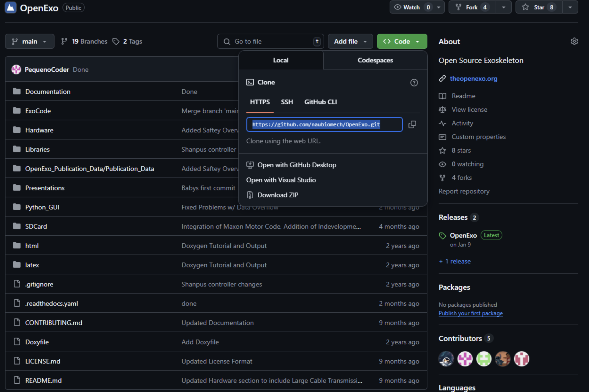

Next, open up your terminal and navigate to where you would like the files to 
reside. As an example, if you'd like the files to reside in the documents folder, type "cd Documents" (note that the capitalization is important) into the terminal.

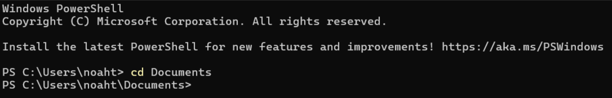

Now that you are in the directory that you want the OpenExo files to be in, Use 
Git to clone the files into that location by typing "git clone <the url you 
copied>."

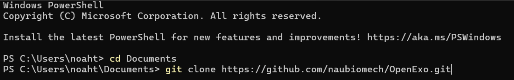

Wait for the process to finish. Once it's done, open up your file browser and 
verify that the installation is there.

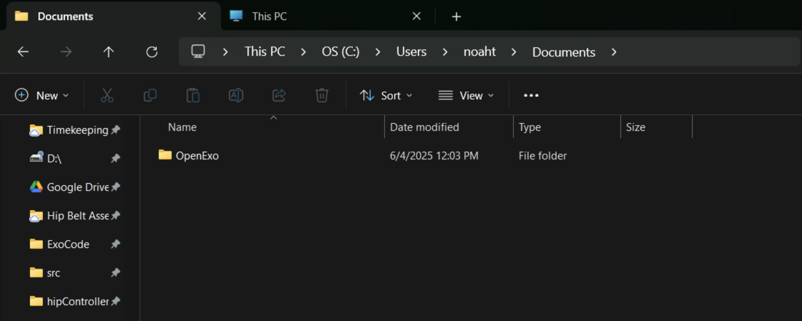

You've now got all of the files necessary to run the exoskeleton downloaded to 
your computer.

Note that this will pull the latest of main from the active development of code. While this *should* be stable, it is possible for something to slip through the cracks.
If you are running into difficulties or suspect that there may be a bug preventing operation, please report the bug to us via the `"Issues" <https://github.com/naubiomech/OpenExo/issues>`__ section on github
and/or in our `bug reporting form <https://docs.google.com/forms/d/e/1FAIpQLScblFFeYDq-VUPGVVFbQY7tO91_8ZhaYLPIeVKO8P5qDeXGsA/viewform>`__. 
If you wish to avoid this possibility, instead download the latest `release <https://github.com/naubiomech/OpenExo/releases>`__ which is the last confirmed stable build of the firmware. 

Orienting Yourself
------------------

As a bit of orientation, you can navigate to the ExoCode folder, where you can 
find most of the code you'll be concerned with. ExoCode.ino (the file that 
should have the Arduino logo next to it) is the file we'll be using to flash 
code to the Teensy and Nano.

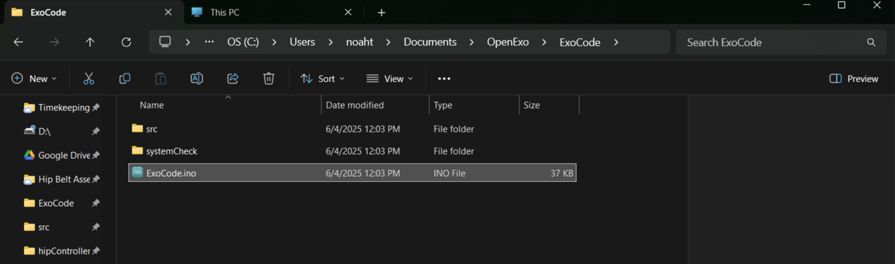

This .ino file is essentially the conductor of all of the other relevant files 
within the ExoCode folder. To flash code, all you neeed to do is ensure that 
any changes you've made to the other files are saved, open the ExoCode.ino file 
with the Arduino IDE, connect to the Teensy, press upload, and repeat for the 
Nano. We'll walk through this process later.

.. raw:: html

    

    === DOCUMENTATION FOLDER ===
    

Going back into the OpenExo folder, you'll see a number of other folders. The 
Documentation folder contains instructions for adding new controllers, adding 
new motors, information on the structure of the code, and more. This is also availabe as part of this ReadTheDocs website. 
You'll want to spend some time skimming through the contents of this folder to familiarize yourself with what's there.

.. raw:: html 

    

    === PYTHON_GUI AND SD CARD ===
    

Also within the OpenExo folder are two other folders relevant to our purposes
here. These folders are Python_GUI and SDCard. Starting with Python_GUI, this 
folder contains the code that runs the interface you'll use to run the
exoskeleton (which we'll cover in a moment).

Each time you run the exo, the data from the trial will be stored within the 
Python_GUI folder as .csv files.

To start the GUI, go back to the OpenExo folder. Once you're there, right click
on the Python_GUI folder and select "Open in Terminal." You should see this in 
your terminal:

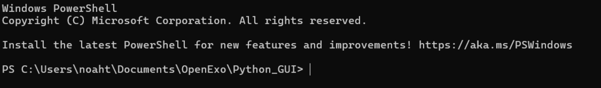

Before we run the GUI for the first time, we'll need to install some 
dependencies. To do so, run the "install_dependencies.py" file by typing the
following in the terminal window we opened just now::

   python3 install_dependencies.py

With the dependencies installed we can now run the GUI. In the terminal, type::

   python3 GUI.py" 

Give it a moment to start up. Once it opens, you will be greeted by this screen: 

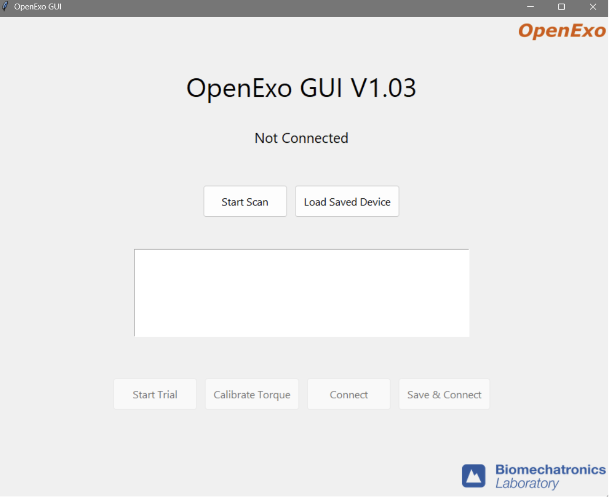

We'll be returning to the GUI when we start our first trial, but for now you can
close this window. 

Navigating back to the OpenExo folder, we'll now take a look at the SDCard 
folder. This folder will be copied onto an SDCard that goes into the Teensy.
We'll cover the contents of this folder more when we flash our OpenExo code to 
the Teensy and Nano for the first time, but for now it will suffice to know 
that the contents of this folder allow you to configrue the system (e.g., set which controller you use, 
change torque setpoints, change which motors you're using, etc).

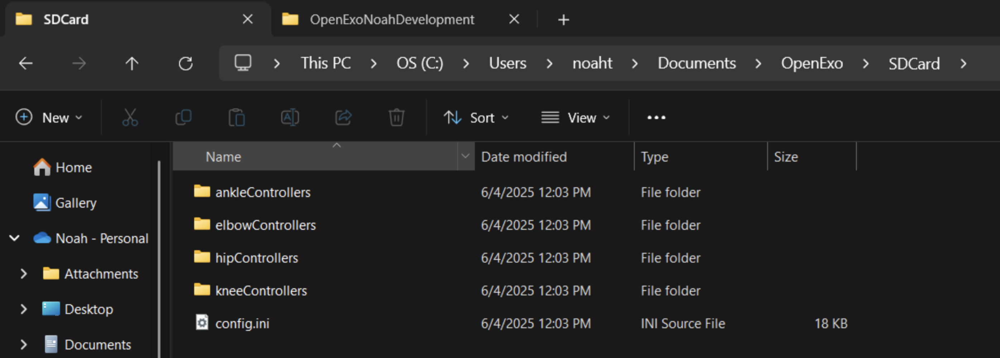

Getting Ready for the First Trial 
---------------------------------

Now that you've downloaded everything you need and have oriented yourself, you'll 
get set up and conduct the first trial. First, make sure that your battery is plugged in and that **the power is off**.
Once this is confirmed, take a moment to verify the integrity of all of the electrical connections on your device.

.. raw:: html 

    

    === LOOKING AT THE PARAMETERS THAT WILL BE PLOTTED ===
    

Before starting the trial, we'll first take a look at the file that defines what gets plotted in the GUI so that 
you have an understanding of what's being plotted.

Within OpenExo > ExoCode > src, open uart_commands.h with VSCode and scroll down 
to the function::

   get_real_time_data [ ~line 330].

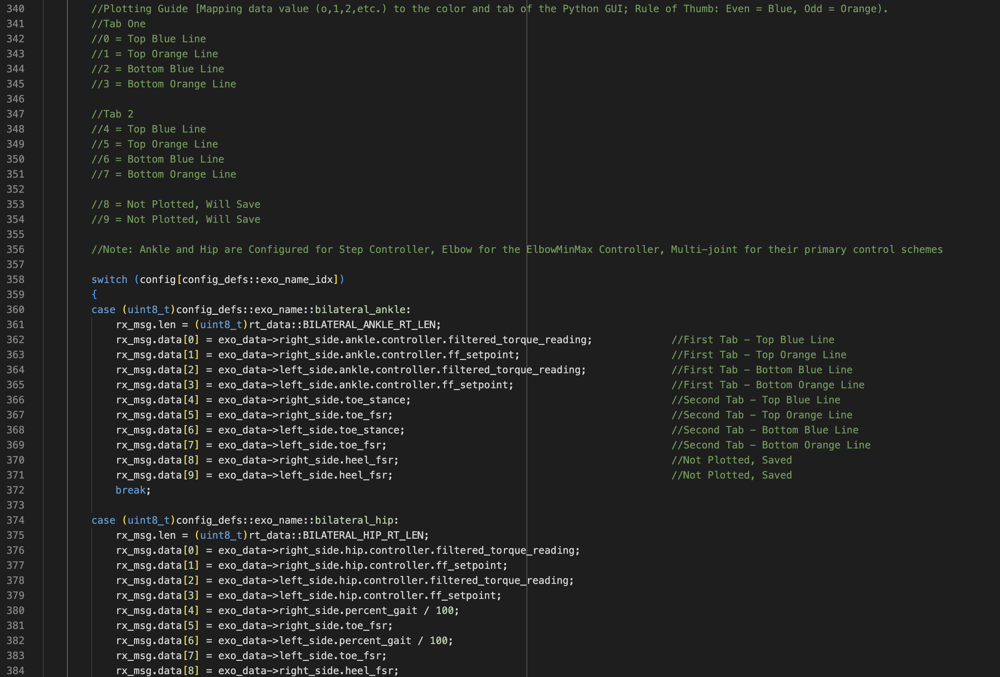

This is where we define what's being plotted in the GUI. In the picture above, 
the green comments indicate what each plotting parameter corresponds to in the 
GUI. You'll notice "Tab 1" and "Tab 2." The GUI has two different plotting 
windows, each containing two plots: a top plot and a bottom plot. Also within the comments 
you'll notice that we have an orange line and a blue line for each plot (that is, each plot itself can have two lines). 

Below the comments is a switch case. Each case corresponds to a different exoskeleton 
configuration. In this walkthrough, we're using the baseline bilateral hip configuration so that's the switch case 
we'll be concerned with::

   case (uint8_t)config_defs::exo_name::bilateral_hip:) [~line 374] 

As mentioned in the comments, the plot for the bilateral hip case is 
initally configured for the step controller, which is the controller we'll be using. 
Within the code, you'll see that in the first plotting window (paramters 0-3, corresponding to 4 data points) 
we have plots for "filtered_torque_reading" and "ff_setpoint" for the left and 
right side. "filtered_torque_reading" is a value read from torque sensors, which
we are not using, so we won't get anything plotted for the blue lines. 
"ff_setpoint" is the torque prescribed to the motors by the exoskeleton, so the 
orange lines in the plots will correspond to how much torque we're
telling the motors to give us. 

The paramters in the second plotting window (paramters 4-7) plot data from FSRs, 
which we aren't using in this example, so if anything gets plotted there, it will 
just be noise from the FSR pins. 

As is indicated in the comments, parameters 8 and 9 will not get plotted but
will save to a .csv file at the end of the trial (as will the rest of the 
parameters).

.. raw:: html

    

    === PERFORMING YOUR FIRST FLASH ===
    

- Open ExoCode.ino in Arduino
- Connect your computer to the Teensy via USB cable.
- Click on the "Select Board" dropdown and select the option that says "Teensy 4.1." 
- Press the upload button (arrow) and wait for the process to complete. 

If you encounter an error stating that the Teensy loader isn't running press upload again (the first attempt should start the loader). 

If you are still getting an error, highlight the word "error" in the 
output window of the Arduino IDE. On the right side of the output window, you'll 
see highlights of other instances of the word "error." Look through these to 
determine what file and lines the error is coming from. From there, you can 
locate the problematic code and fix the error. Make sure you save your changes 
before trying to flash again. 

With the code uploaded to the Teensy, we'll move on to the Nano. 

- Plug the USB cable into the Nano
- Choose the "Arduino Nano 33 BLE" from the "Select Board" dropdown
- Upload

Note that this upload usually takes considerably longer than the Teensy (hence we recommend flashing the Teensy first to detect any potential errors).
The process should complete successfully. If it doesn't, try the same troubleshooting method of highlighting the word "error" in the output window and searching for its source.

Next we'll get the SD card configured and then we'll be ready to run our first trial.

.. raw:: html

    

    === SETTING UP THE SD CARD ===
    

Here we will:
   - Copy the relevant files over to the SD card
   - Set the exo configuration we're using
   - Establish the motors used 
   - Set the desired controller

First, plug the SD card into your computer (you'll likely need a micro SD to SD
adapter) and navigate to the OpenExo folder that you downloaded onto your 
computer. Within that folder, open the "SDCard" folder and copy the contents
into the SD card you just plugged into your computer. Make sure that any time you want to alter the parameters of the SD card, 
you're editing the SD card itself, not the folder in OpenExo.

Now, making sure you're editing the SD card itself, **open config.ini**. This is 
what we'll edit first. Here, you'll see various configurations of OpenExo 
(bilateralHip, bilateralAnkle, etc.) and various parameters you can edit. As the 
first order of business, we'll go into "[Exo]" and make sure we're using the 
"bilateralHip" configuration as shown below.

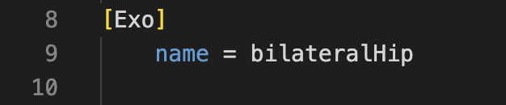

It is also worth double checking that the software is using the correct PCB. Detailed instructions on confirming the PCB are outlined 
under "[Board]".Open "Config.h" within the OpenExo src folder and look for "BOARD_VERSION". It is here that you will want to make sure the board 
corresponds to the one you actually have on the device. Above this section you will see a list of available boards in the codebase and their names. 
In this example, we are using the default CAN-motor board, "AK_Board_V0_5_1". If this is labeled next to "BOARD_VERSION" (as below) then you are good to go!
If a different board is there or you are using a different version of the PCB, make sure the version is correct and re-flash the Teensy and Nano.

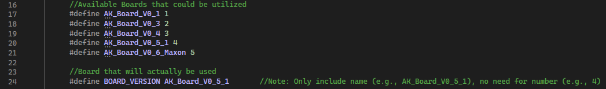

Now that we know we're using the correct configuration and have confirmed the correct PCB is being utilized, locate the desired configuration 
and its parameters below (in this case the bilateralHip configuration, ~line 234). Set the following parameters:

.. raw:: html

    

    
Sides = bilateral

    
Hip = AK60v1.1 (or the motor you're using)

    
hipDefaultController = step

    

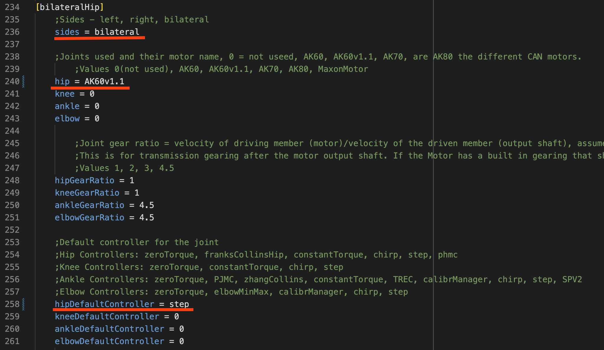

These will ensure that the desired sides (bilateral), motors/joints (Hip = AK60v1.1), and controller (step) are utilized. 
With these changes made to config.ini, save and exit. Within the SD card, go to hipControllers > step.csv. 

This file contains controller parameters specific to the step controller, such as 
the magnitude of the torque prescription, the duration of torque, and the rest 
perieds between torque applications.

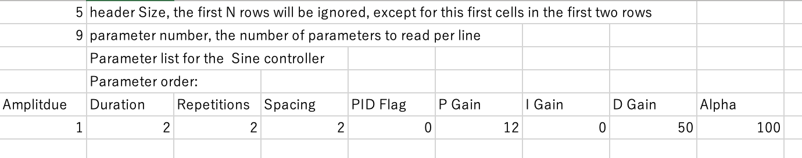

Walking through the parameters, you'll see Amplitude is set to 1. This is the 
torque setpoint in Newton-meters. 1 Newton-meter is a good value to have for our  
test, as it's a very light application of torque. 

Moving on, you'll see Duration is set to 2. This is how long each "step" of 
torque is, in seconds. Repititions is how many "steps" there are. Spacing is the 
interval (in seconds) between "steps." 

Next is the PID flag, which tells the exoskeleton whether you want to use PID 
control. 1 means yes, 0 means no. We'll leave it at 0 (since we do not have a torque transducer). 
After this are the individual P, I, and D parameters, which you can tune as you please if and when you use 
PID control. Finally, Alpha is a filtering parameter, which can help smooth the measured torque (closer to 100 means less filtered, closer to 0 means more filtered). 
Again, we're not using measured torque for this hip test so we won't be concerned with any of these parameters.

To get some practice editing one of these .csv files, we'll change the duration, 
repititions, and spacing parameters. 

We'll set the duration to 3 seconds, tell the exo to do 5 repititions, and set 
the spacing also to 3 seconds. Below you can see what the changes look like.

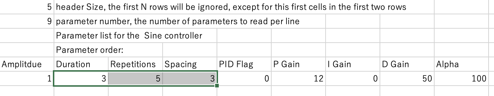

Make sure you save the changes. Once you have, you can eject the SD card and put it back into 
the Teensy. With the code flashed to the Teensy and Nano and the SD card 
configured, we're ready for our first trial.

Conducting the First Trial
--------------------------

As mentioned, for the first trial we'll be using the step controller. If you 
run into any issues during this section, there is a troubleshooting section 
immediately after this one. 

With the battery connected, put the exo on, fasten the uprights to your legs and
turn the power on. Open up the GUI as you did before (no need to run the 
dependencies install script again, just start the GUI). With the exo fastened at 
your waist and thighs, press the "Start Scan" button in the GUI. After a 
moment, you should get a string of numbers and letters pop up, similar to the 
image below.

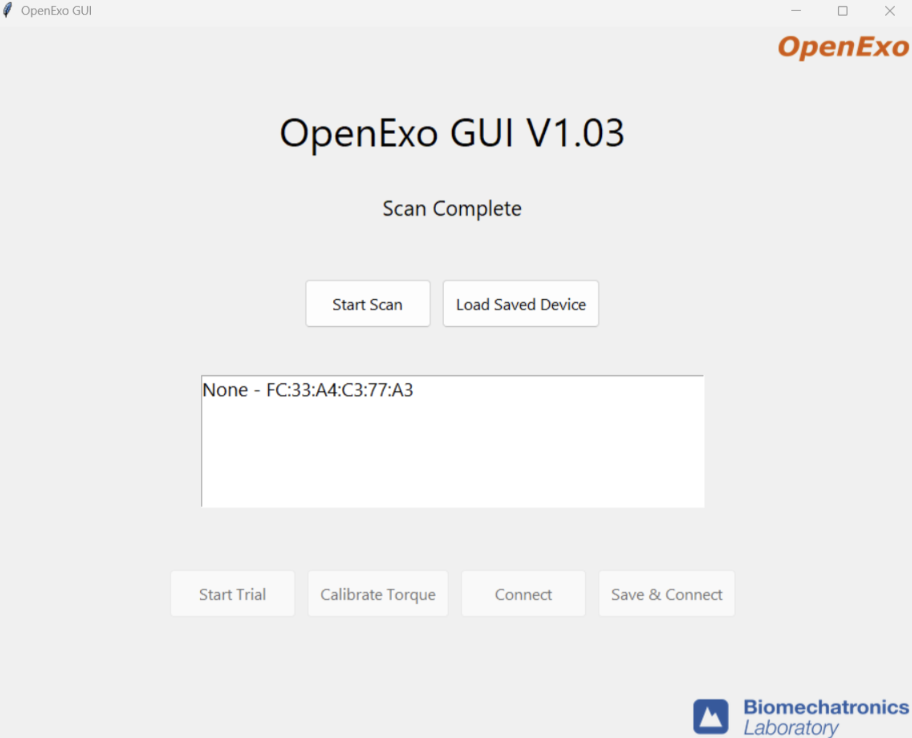

Select the text that appeared and click "Save and Connect." Again, ensuring that 
the uprights are fastened to prevent them moving uncontrollably, press "Start 
Trial." The GUI will then move into the active trial page with two plots shown- 
one for the left side and one for the right.

You should feel breif, mild applications of torque for five repititions. Looking 
at the plots, you will see the torque prescription in real time, as seen below.

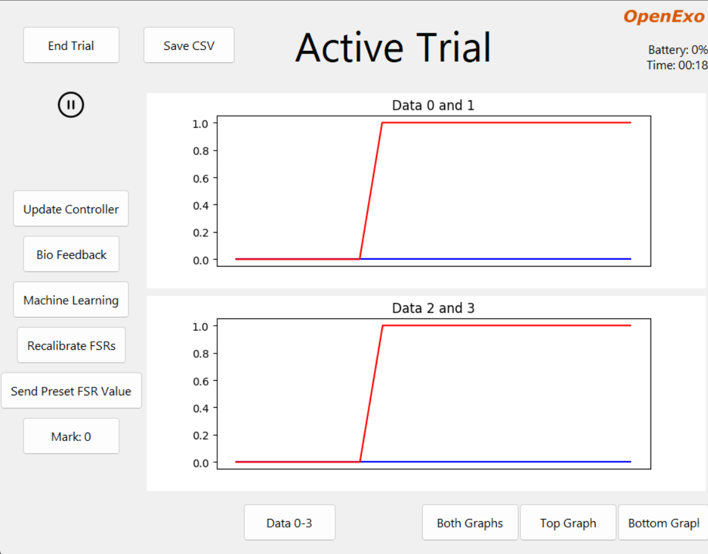

Troubleshooting 
---------------

If you ran into an issue during your trial, one of two things likely happened:

1) You got no torque and no plot of the torque prescription. 
    If this is the case, the issue is likely due to the SD card not being 
    configured properly. You may have the controller or another parameter set 
    improperly. Go back to the "Setting up the SD Card" section of this guide 
    and ensure that everything is set correctly.

2) You got no torque but did get a plot of the torque prescription. 
    If this is the case, the likely cause is faulty CAN wires or the motor is 
    set improperly in the SD card. Check the SD card to make sure that the motor 
    set in the bilateralHip configuration is "Hip = AK60v1.1" (or the motor you 
    are using). If it is, the CAN wire is likely the issue. Remove the CAN wires 
    from the device and inspect them well. The most common failure point is at 
    the base of the white connectors. Check for fraying or total disconnection 
    of the wires. If you see fraying or disconnection, repair the CAN wire and 
    Try conducting the trial again.

All in all, if you're getting issues while trying to use the step controller the 
source of the problem likely lies either in the configuration within the SD card or 
with the CAN communication to the motors. The step controller doesn't use any 
external sensors. As such, it's a good controller to use for first time startups 
and troubleshooting. Note that if all else fails and you're absolutely certain 
that you have the correct motor set in the SD card, the issue may be the motor 
itself. We have run into issues with the AK60v1.1 motors sometimes being
unreliable. If that's the case, contact the CubeMars support.