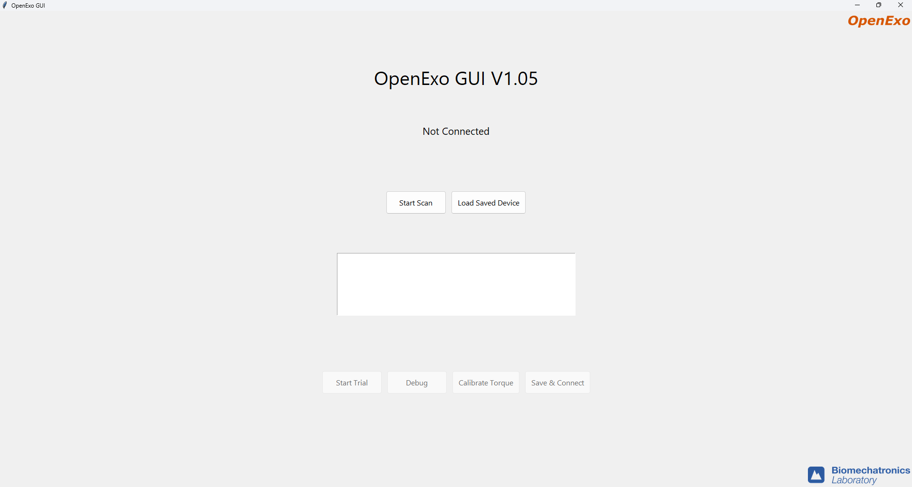

OpenExo GUI
=============

Overview
--------

This application runs on any system with Python 3.12 installed. Required libraries can be installed via pip.

**Open Source Application** utilizing the OpenExo API to search, connect to, and control OpenExo systems.

This project is licensed under the MIT License and provides an open-source solution for accessible, modifiable control of the OpenExo system.

Minimum System Requirements
---------------------------

**Operating System:**

- Windows 7 or newer
- macOS 10.9 or newer

**Python Version:**

- Python 3.2 or newer

**Hardware:**

- Processor: Dual-core (e.g., Intel Core i3 or AMD equivalent)
- Memory (RAM): 2 GB minimum (4 GB recommended)
- Storage: 100 MB free space (1 GB recommended for large datasets)
- Display: 768×1024 resolution minimum

Installation Guide
------------------

`Video Guide <https://youtu.be/VnQeUM2K6Vg>`__

BLE (Bluetooth Low Energy) provides connections between this API and the exoskeletons. We use `Bleak <https://bleak.readthedocs.io/en/latest/>`__ for all BLE operations.

Required Python libraries:

- matplotlib
- async_tkinter_loop
- pygame
- numpy
- bleak
- pandas
- scikit-learn
- micromlgen
- pillow

To install all dependencies, open the command prompt in the "Python_GUI" folder and run::

   python install_dependencies.py

General Workflow
----------------

Program control flow diagram::

   .. image:: photos/programflow.png
      :alt: Program Control Flow
      :width: 500px

Starting the Application
~~~~~~~~~~~~~~~~~~~~~~~~

1. Ensure Bluetooth is enabled on your device.
2. Open a terminal and navigate to the project directory.
3. Run::

      python3 GUI.py

4. The GUI will launch with frames for system interaction.

Scanning for Devices
~~~~~~~~~~~~~~~~~~~~

1. Press the **Scan** button to search for exoskeletons.
2. If Bluetooth is disabled, an error message will appear.

Navigating the Interface
~~~~~~~~~~~~~~~~~~~~~~~~

- **Scan Window:** Initiate scanning and connect to devices.
- **Active Trial:** Monitor ongoing trials and sessions.
- **Biofeedback:** Access real-time feedback tools.
- **Machine Learning:** Train and test models for personalized control.
- **Update Torque:** Modify exoskeleton parameters.

Video Example
~~~~~~~~~~~~~

`Example Video <https://github.com/user-attachments/assets/6269629e-252b-4e77-b327-0914770ae9e3>`_

Adding a Button
---------------

To add a button in a frame within the ``views/`` folder::

   class YourFrame(tk.Frame):
       def __init__(self, parent):
           super().__init__(parent)
           self.create_widgets()

       def create_widgets(self):
           my_button = tk.Button(
               self,
               text="My New Button",
               command=self.my_button_action
           )
           my_button.pack(pady=10)

       def my_button_action(self):
           print("My New Button was clicked!")

Define button behavior in ``my_button_action()``.

Modifying the Graphing
----------------------

Adjust the ``BasePlot.update_plot`` method::

   def update_plot(self, xValues, yValues, secondY, title):
       max_points = -20  # change to display more/fewer points
       xValues = xValues[max_points:]
       yValues = yValues[max_points:]
       secondY = secondY[max_points:]

Customize axes and titles::

   self.ax.set_title(title)
   self.ax.set_xlabel("Time")
   self.ax.set_ylabel("Value")

Each plot subclass has an ``animate()`` method—modify it to change data sourcing or display.

Adding a New Frame
------------------

1. **Create the frame class:** Add a new file (e.g., ``views/newFeature.py``)
::
   import tkinter as tk

   class NewFeature(tk.Frame):
       def __init__(self, parent, controller):
           super().__init__(parent)
           self.controller = controller

           label = tk.Label(self, text="New Feature Frame", font=("Arial", 24))
           label.pack(pady=20)

           button = tk.Button(
               self,
               text="Go to Scan Window",
               command=lambda: controller.show_frame("ScanWindow")
           )
           button.pack(pady=10)

2. **Update the controller:** In your main app file, import and register the new frame
::

   from views.newFeature import NewFeature

   for F in (ScanWindow, ActiveTrial, UpdateTorque, BioFeedback, MachineLearning, NewFeature):
       # existing frame setup

3. **Add navigation:** Create a button in any frame to show the new feature
::

   button = tk.Button(
       self,
       text="Go to New Feature",
       command=lambda: controller.show_frame("NewFeature")
   )
   button.pack(pady=10)

Biofeedback Frame
-----------------

**Purpose:** Provides visual and auditory feedback during sessions, helping users reach performance goals using real-time sensor data.

**Signal Source:**

- Uses force-sensitive resistors (FSRs) for plantar pressure or estimated ankle power.
- Accessed via::

   self.master.controller.deviceManager._realTimeProcessor._chart_data

- Switch between legs::

   _chart_data.leftFsr  or  _chart_data.rightFsr

Modifying the Signal
~~~~~~~~~~~~~~~~~~~~

1. Locate the ``FSRPlot`` class in ``chart.py``.
2. Update the data source variable::

   self.master.controller.deviceManager._realTimeProcessor._chart_data

Features and Controls
~~~~~~~~~~~~~~~~~~~~~

**Graphing:**

- Real-time display of pressure sensor data.
- Goal threshold lines when targets are set.

**Buttons:**

- **Back:** Return to the Active Trial frame.
- **Left/Right Leg Toggle:** Switch graph between legs.
- **Set Target Value:** Input and display training goals.
- **Reset Target Value:** Clear goals.
- **Mark Trial:** Flag events for analysis.
- **Recalibrate FSRs:** Initiate sensor recalibration.